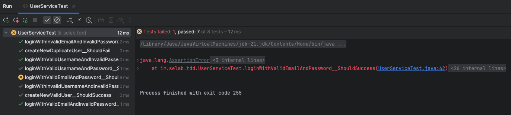
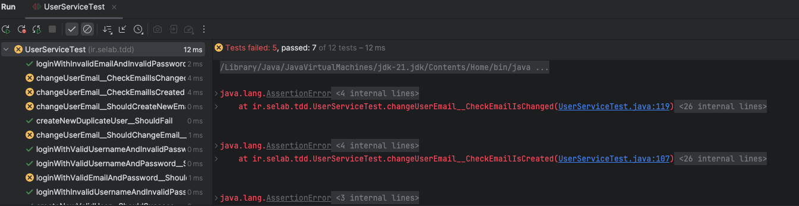
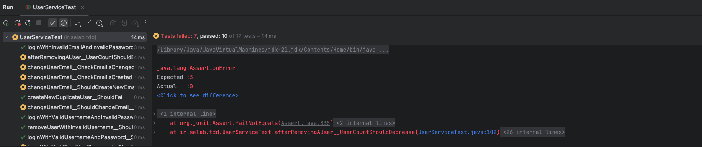

# EXP3

## روش TDD برای فیچرهای مرتبط به email:
در ابتدا تست‌هایی می‌نویسیم که مربوط به login کردن با ایمیل باشد. این تست‌ها مطابق روش TDD باید ارور بخورند و پاس نشوند. سپس مرحله‌به‌مرحله پیش می‌رویم و develop می‌کنیم بطوریکه تست‌ها پاس بشوند. در ابتدا این تست‌ها را ببینیم:

```java
public class UserServiceTest {
    private UserService userService;
    ....
    ....
    
    @Test
    public void loginWithValidEmailAndPassword__ShouldSuccess() {
        boolean login = userService.loginWithEmail("hasan@gmail.com", "hasan123@");
        assertTrue(login);
    }

    @Test
    public void loginWithValidEmailAndInvalidPassword__ShouldFail() {
        boolean login = userService.loginWithEmail("hasan@gmail.com", "abcd");
        assertFalse(login);
    }

    @Test
    public void loginWithInvalidEmailAndInvalidPassword__ShouldFail() {
        boolean login = userService.loginWithEmail("admin@admin.edu", "abcd");
        assertFalse(login);
    }

}
```
این تست‌ها به‌ترتیب برای بررسی لاگین شدن با ایمیل و پسورد درست، لاگین کردن با ایمیل درست ولی پسورد نادرست و لاگین کردن با ایمیل غلط (ناموجود) می‌باشد. توجه کنید که برای تست کردن ویژگی‌های ایمیلی، یک کاربر با ویژگی زیر درتابع `setUp` که از پیش نوشته شده بود، اضافه کردیم:

```java
public void setUp() {
        UserRepository userRepository = new UserRepository(List.of());
        userService = new UserService(userRepository);
        userService.registerUser("admin", "1234");
        userService.registerUser("ali", "qwert");
        userService.registerUser("hasan", "hasan123@", "hasan@gmail.com");
    }
```
که ایمیل `hasan@gmail.com` دارد.
در این مرحله (پیش از نوشتن کد logic برای پاس شدن تست‌ها) می‌بینیم که این تست‌ها fail می شوند:



### توضیحات مربوط به مرحله‌ی development این فیچر:

[TODO]: By Naser

## روش TDD برای فیچرهای مربوط به تغییر ایمیل کاربر:
در ادامه برای فیچر تغییر ایمیل کاربر، تست می‌نویسیم. این تست‌ها باید fail شوند و ما سپس به روش TDD پیش برویم تا تمامی تست‌ها پاس بشوند. تست‌های مربوط به این فیچر به صورت زیر می‌باشد:

```java
    @Test
    public void changeUserEmail__ShouldCreateNewEmailAddress__IfPrevEmailDoesNotExist() {
        boolean b = userService.changeUserEmail("admin", "admin@corp.co");
        assertTrue(b);
    }

    @Test
    public void changeUserEmail__CheckEmailIsCreated() {
        assertNotNull(userService.getUserByEmail("admin@corp.co"));
    }

    @Test
    public void changeUserEmail__ShouldChangeEmail__IfPrevEmailExists() {
        boolean b = userService.changeUserEmail("hasan", "hasan@yahoo.com");
        assertTrue(b);
    }

    @Test
    public void changeUserEmail__CheckEmailIsChanged() {
        assertNull(userService.getUserByEmail("hasan@gmail.com"));
        assertNotNull(userService.getUserByEmail("hasan@yahoo.com"));
    }
```
این تست‌ها مرحله به مرحله، در ابتدا چک می‌کنند که اگر درخواست تغییر ایمیل برای کاربری آمد که از پیش ایمیلی برای اون تنظیم نشده بود، باید تایید شود و این ایمیل برای اون ست شود. در ادامه،‌چک می‌کنیم که این ایمیل برای آن user خاص واقعا اضافه شده است یا خیر. سپس، حالتی را چک می‌کنیم که کاربری از ثبل یک ایمیل ثبت شده داشته باشد و بخواهد آنرا تغییر دهد. بعد، چک می‌کنیم که این ایمیل جایگزین ایمیل قبلی برای آن کاربر شده باشد. در نهایت هم، بررسی می‌کنیم که ایمیل قبلی کاربر دیگر در ویژگی‌های او وجود نداشته باشد و صرفا با ایمیل جدید شناسایی شود.

وضعیت تست‌ها پیش از انجام development بصورت زیر است:


### توضیحات مربوط به مرحله‌ی development این فیچر:

[TODO]: By Naser

## روش TDD برای فیچرهای مربوط به حذف کاربر:
در ادامه برای ویژگی حذف کاربران تست می‌نویسیم. این تست‌ها باید fail شوند و ما سپس به روش TDD پیش برویم تا تمامی تست‌ها پاس بشوند. تست‌های مربوط به این فیچر به صورت زیر می‌باشد:

```java
    @Test
    public void removeUser__ShouldSuccess() {
        boolean b = userService.removeUser("ali");
        assertTrue(b);
    }

    @Test
    public void removeUser__ShouldFail() {
        boolean b = userService.removeUser("hasanGholi");
        assertFalse(b);
    }

    @Test
    public void removeUserShouldDeleteUserFromRepository() {
        assertNull(userService.getUserByUsername("ali"));
    }

    @Test
    public void removeUserWithInvalidUsername__ShouldFail() {
        boolean b = userService.removeUser("ahmad");
        assertFalse(b);
    }

    @Test
    public void afterRemovingAUser__UserCountShouldDecrease() {
        assertEquals(3, userService.getUserCount());
    }
```
این تست‌ها به‌ترتیب بررسی می‌کند که حذف user بصورت موفقیت‌آمیز‌ انجام شود(درصورتیکه وجود داشته باشد)، برگرداندن `False` اگر user وجود نداشته باشد،‌ بررسی اینکه کاربر پس از عملیات حذف، از `UserRepository` مربوطه نیز پاک شده باشد و همچنین تعداد کاربران (`UserCount`) کم شده باشد.

وضعیت تست‌ها پیش از انجام development بصورت زیر است:


### توضیحات مربوط به مرحله‌ی development این فیچر:

[TODO]: By Naser

## بررسی Code Coverage تست‌ها:

[TODO]: By Soheil